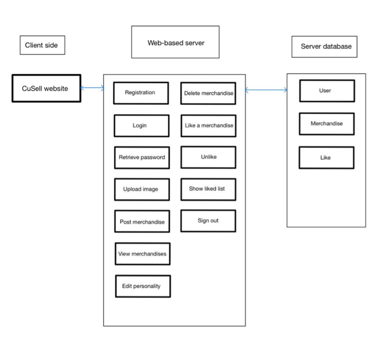
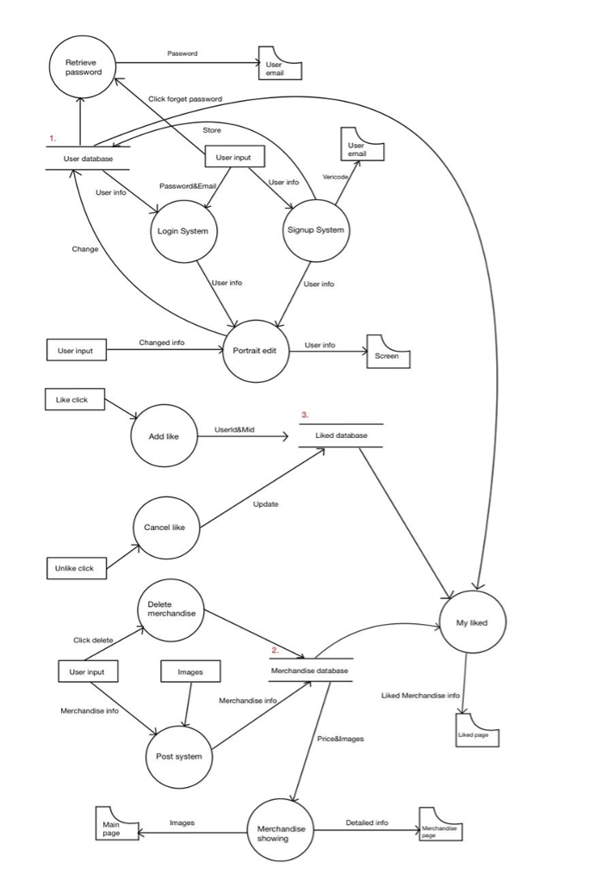
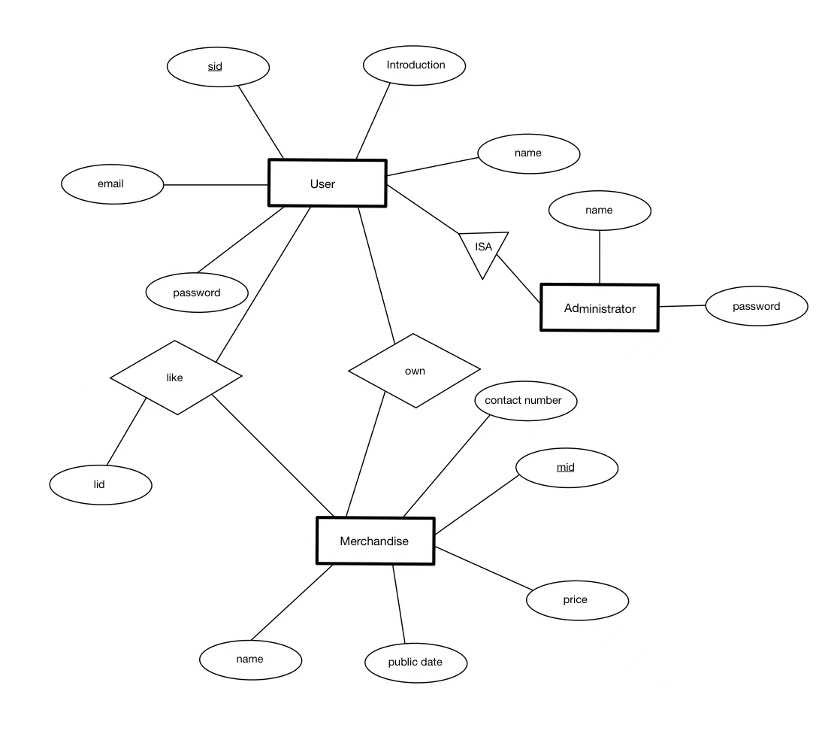

# CuSell

## Project Overview

During the hostel check-out period, our team discovered an inspiring opportunity that CUHK students are enthusiastic about trading their own second-hand merchandise among themselves. Also, the potential and scale of the secondary market in CUHK are enormous. However, after comparing several different platforms available on the internet, we notice that it is hard to find a single platform that satisfies both criteria below:

1. Designed and built specifically for students in CUHK.
2. Trading second-hand merchandise is the main function of this platform.

Therefore, in order to fill the vacuum in the trading tools of CUHK’s secondary market, we would love to put forward our project: CuSell. This platform consists of 5 noteworthy features that include Users Signup & Login, Surfing System, Communication System, Merchandise System and Personal Information System. The combination of these features provides the users with a smooth and efficient way of trading second-hand merchandise among CUHK students.

## Objective

We are aiming to provide all CUHK students with the most convenient and reliable platform where they can trade their second-hand merchandise. We also focus on minimizing the procedures and accelerating the speed when the users are dealing with each other. Hopefully, users will be able to finish trading and transactions within a day.

This platform will offer the users an opportunity to search and gather all the merchandise information they need on a single page, where they can figure out what is the best choice for them efficiently. Additionally, all the items to be traded on this platform shall be posted with authentic photos and detailed descriptions, and the buyers are allowed to have a conversation with the sellers to negotiate the price of the merchandise. Thus, both parties of the transactions will be satisfied with the trading results.

Furthermore, we pay significant attention to the safety and security issues of our project, and these two qualities should be maximized if the users choose to trade through our platform.

Eventually, we are dedicated to building our product to be the best platform at the current stage that any CUHK students could think of to perform their second-hand merchandise trading.

## System Architectural Design

### System Architecture

### Data Flow Diagram

### ER Diagram

## Procedures and Functions

### 1. Authentication

#### 1.1. Registration

The user can sign up for a new account for log in via entering email and password that is not taken by others before. There is an email containing verification code sent to user email account to verify registration email. If the email is not used and the verification code is correct, then it goes to user’s home page. Otherwise, alert the user with the specific error.

#### 1.2. Log in

The user is required to log in using their email and password. Our system will check whether that user exists or not by comparing server data. If they are consistent with the data in the database, then go to user’s home page. Otherwise, alert the user that they have entered something wrong.

#### 1.3. Retrieve password

The user clicks `Forget Password`, and then the system would send an email to his/her email account according to the email has been entered by the user which includes the password.

### 2. Profile

#### 2.1. Edit personal information

The user can click the edit button besides name and information, then user needs to input the information they want to change. The information would be changed and stored in the user database and finally redirect to the user home page.

#### 2.2. Change password

The user can click ‘Change password’, and they need to input the new password and click save bottom, then the system would update their login details and contents in the database and redirect to the user home page.

#### 2.3. Upload image

The user can click ‘upload image’ in the user home page, and then they can choose local image to upload to change their portrait image and merchandise image.

### 3. Merchandise

#### 3.1. Post merchandise

In the post page, users can post merchandise by adding the image, information, and price of it. The system would transfer the data to the merchandise database and store the merchandise information in the database. After that, the system would redirect the current page to the user home page.

#### 3.2. View merchandise

In main page, server will transfer all the information to the front end so that all merchandises will be shown in the main page and all the users can see them.

#### 3.3. Delete merchandise

In user home page, the user can delete their merchandise by clicking the rubbish bin image beside the name of their merchandise. After the click, they would be asked by the system if they really want to delete the merchandise. If the answer is yes, then the server would delete the merchandise information in the merchandise database and redirect the page to the new user home page without deleted merchandise.

### 4. Liked List

#### 4.1. Add Merchandise to Liked List

In the merchandise page, the user could click the blank heart to add the merchandise to their liked list, and the blank heart would become red. The system would return how many people is liking this merchandise to the page and shows the number beside the red heart.

#### 4.2. Delete Merchandise from Liked List

In the merchandise page, the user could click the red heart to delete the merchandise from their liked list, and the red hear would become blank and the number would also disappear. The system would delete this relationship in the liked database and redirect the page to the new merchandise page.

## Improvements

In technical level, we all get familiar with Python, Django and MySQL database operation, and then we learned and practice some knowledge of JavaScript, HTML and cloud base setting. Additionally, we practice a lot in GitHub and Word operation skills.

In general, our process follows the waterfall model. The first thing we do is to analyze the market requirement and set our target. Then we perform a high-level design and try to divide the terrible problem into many easy sub-questions. The division of labor and schedule came out and was assigned to teammates at this time. After that, we start coding, integrating, and testing. In the development process, we realized that some functions of our first design are redundant or not urgent. For example, from our experience of using many Apps, people seldom use the built-in “Chat” to communicate. In opposite they prefer to use WeChat or WhatsApp directly, so we cut off the “Chat” function from our project.

Although we realized the importance of good timing at the very beginning, scheduling still becomes a big problem. During the developing process, there are always some trivial unexpected happening to delay us. For example, the GitHub setting, and pulling/pushing operation confused us for two days. In the end, we have to delete some meaningful functions like Searching to meet the deadline. Another problem is that we did not follow the guidelines of the project closely, which resulted in some required functions lacking in our project. Although we found and built them in the end, the emergency patches are not well designed and tested. So, if we do this project again, we will leave more time for accidents, consider the plan more reality, and pay more attention to project requirements.

## Conclusion

CuSell is a web application that aims to give a platform for CUHK students to exchange and trade their unused personal items. Based on the Django framework, CuSell is built as an innovative product that can give students an easier way to recycle their useless things which may be still valuable to others. Due to the time limitation, our product is too prototypical to be used in the market. Our team plans to complete the total functions of CuSell. Originally, we hoped people can perform all required operations to sell or buy some merchandise on CuSell. on CuSell. But unfortunately, we cut off the function of chatting and searching. In general, we are satisfied with what we have just done this semester and will keep on completing it in the coming summer.
